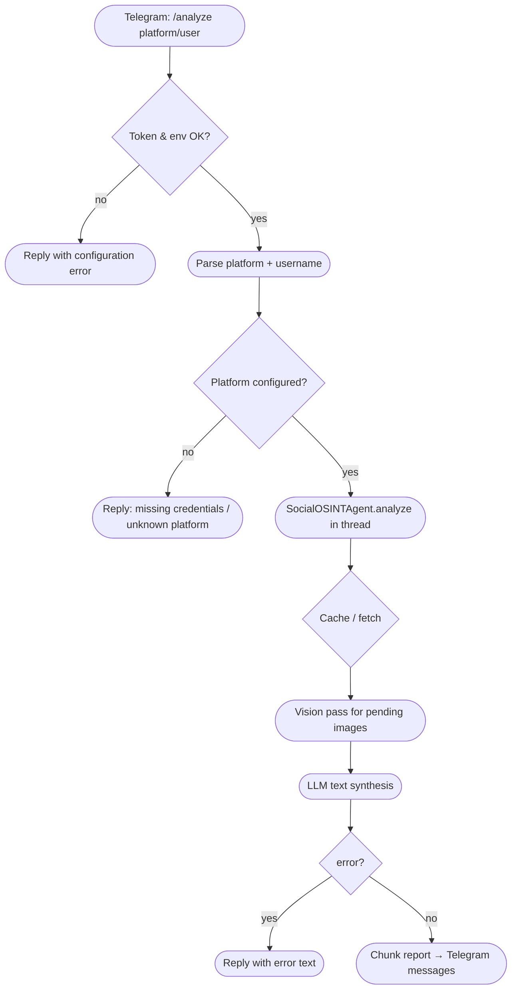

# OSINT Relay Agent

**OSINT Relay Agent** is a migration of the [OWASP Social OSINT Agent](https://github.com/bm-github/owasp-social-osint-agent) toward a **sandboxed, read-only, ChatOps-first** OSINT workflow. The same core engine (multi-platform fetchers, caching, vision + text LLM analysis, XML-wrapped UGC for indirect-injection mitigation) now drives a **Telegram bot** as the primary interface, with optional **CLI**, **stdin JSON**, and **web UI** for parity during the transition.

The agent gathers public activity across supported platforms, synthesizes Markdown reports via an OpenAI-compatible API, and is designed for **continuous monitoring** and **multi-model routing** in later phases (see [Product specification](spec.md)).

## Key features

- **Telegram ChatOps (Phase 1):** Run analyses from private chat with `/analyze <platform>/<username>`. Long reports are split for Telegram message limits; output is the same Markdown-style report the engine produces elsewhere.

- **Shared engine with OWASP Social OSINT Agent:** Twitter/X, Reddit, Bluesky, GitHub, Hacker News, Mastodon; normalized posts, caching, rate-limit handling, optional image analysis, domain extraction, and externalized prompts under `socialosintagent/prompts/`.

- **Headless analyzer:** `SocialOSINTAgent.analyze()` returns structured dicts (metadata, report, entities, error flag) without Rich console coupling, so ChatOps and automation can format output safely.

- **Web interface (optional):** Same FastAPI app as upstream — sessions, SSE progress, contacts, timeline, cache manager. Run with `uvicorn` when you need a browser UI.

- **Interactive CLI & stdin mode:** Rich-based menus and `--stdin` JSON batch mode remain available for scripting and debugging.

- **Offline mode (`--offline`):** Analysis from local cache only; no live fetches or new vision calls.

- **Security-oriented prompts:** Untrusted social content is wrapped in structured XML in LLM prompts to clarify system vs. user-generated boundaries (indirect prompt injection mitigation). See upstream documentation for full threat-model context.

- **Read-only by design:** The agent fetches public data and sends replies to *your* chat; it does not post to social platforms or interact with targets.

## Roadmap (from `spec.md`)

| Phase | Focus |
|-------|--------|
| **1** | Telegram bot (`chatops_handler.py`), `/analyze`, analyzer without Rich in the execution path |
| **2** | LLM router: cheap triage vs. heavy synthesis |
| **3** | `watcher.py` — continuous monitoring and keyword alerts |
| **4** | Docker Compose daemon for the bot |

## Telegram bot (recommended entrypoint)

### Prerequisites

- A Telegram bot token from [@BotFather](https://t.me/BotFather).
- The same **LLM** and **platform** environment variables as the OWASP Social OSINT Agent (see [Environment variables](#environment-variables)).

### Run

From the project root (with `.env` loaded and dependencies installed):

```bash
python -m socialosintagent.chatops_handler
```

Logs are written to `logs/chatops.log` and stderr.

### Commands

| Command | Description |
|---------|-------------|
| `/start`, `/help` | Short usage text |
| `/analyze <platform>/<username>` | Run the default OSINT analysis and reply with the report (e.g. `/analyze twitter/nasa`) |

**Mastodon:** Use the first `/` only to separate platform from handle, e.g. `/analyze mastodon/user@instance.social`.

Reports are sent as **plain text** chunks so arbitrary Markdown from the model does not break Telegram parse modes. You can copy the full Markdown elsewhere if needed.

## Optional: web interface

Same behavior as OWASP Social OSINT Agent: session management, live SSE progress, reports, contacts, and cache UI.

```bash
uvicorn socialosintagent.web_server:app --host 127.0.0.1 --port 8000 --reload
```

Then open `http://localhost:8000`. Set `OSINT_WEB_USER` and `OSINT_WEB_PASSWORD` in `.env` for HTTP Basic Auth when exposing beyond localhost.

## Optional: CLI and stdin

**Interactive CLI**

```bash
python -m socialosintagent.main
```

**Stdin JSON** (non-interactive)

```bash
echo '{
  "platforms": { "hackernews": ["pg"] },
  "query": "Brief summary of themes in recent activity?"
}' | python -m socialosintagent.main --stdin --no-auto-save
```

### CLI flags

- `--stdin` — Read analysis request from stdin as JSON.
- `--format [json|markdown]` — Output format when saving (default: `markdown`).
- `--no-auto-save` — Do not auto-save reports to `data/outputs/`.
- `--log-level [DEBUG|INFO|WARNING|ERROR|CRITICAL]` — Default: `WARNING`.
- `--offline` — Cache-only mode.
- `--unsafe-allow-external-media` — Allow media downloads outside default platform CDNs (use with care).

### Interactive session commands

Inside an analysis session: `/loadmore`, `/refresh`, `/add`, `/remove`, `/status`, `/help`, `/exit` (see upstream README for details).

## Visual workflow (ChatOps analyze path)

<details>
<summary><b>Click to expand flowchart</b></summary>



In **`--offline`** mode, live fetch and new vision analysis are skipped; behavior matches the OWASP agent for cached data only.

</details>

## Installation

### Prerequisites

- **Python 3.11+** (3.12+ recommended; match what you use for OWASP Social OSINT Agent).
- API keys / tokens for LLM and any platforms you enable (see below).

### 1. Clone and enter the repository

```bash
git clone <your-repo-url>
cd osintbot
```

### 2. Virtual environment

```bash
python -m venv .venv
source .venv/bin/activate   # Windows: .venv\Scripts\activate
```

### 3. Install dependencies

**Core + CLI + web** — align with [OWASP Social OSINT Agent `requirements.txt`](https://github.com/bm-github/owasp-social-osint-agent/blob/main/requirements.txt) and [`requirements-web.txt`](https://github.com/bm-github/owasp-social-osint-agent/blob/main/requirements-web.txt) if you use the web UI. If this tree lives beside the upstream repo:

```bash
pip install -r ../owasp-social-osint-agent/requirements.txt
pip install -r ../owasp-social-osint-agent/requirements-web.txt
```

**ChatOps (Telegram)**

```bash
pip install -r requirements.txt
```

For tests, also install upstream `requirements-dev.txt` (e.g. `pytest`, `pytest-mock`).

### 4. Environment variables

Create a `.env` file in the project root (never commit it). Extend the OWASP template with the bot token:

```dotenv
# --- ChatOps (Telegram) ---
TELEGRAM_BOT_TOKEN="your_token_from_botfather"

# --- LLM (required) ---
LLM_API_KEY="your_llm_api_key"
LLM_API_BASE_URL="https://api.example.com/v1"
ANALYSIS_MODEL="your_text_analysis_model_name"
IMAGE_ANALYSIS_MODEL="your_vision_model_name"

# --- Optional: OpenRouter ---
# OPENROUTER_REFERER="http://localhost:3000"
# OPENROUTER_X_TITLE="owasp-secure-chatops-osint-agent"

# --- Platforms (as needed) ---
TWITTER_BEARER_TOKEN="..."
REDDIT_CLIENT_ID="..."
REDDIT_CLIENT_SECRET="..."
REDDIT_USER_AGENT="YourApp/1.0 by YourUsername"
BLUESKY_IDENTIFIER="handle.bsky.social"
BLUESKY_APP_SECRET="..."
GITHUB_TOKEN="..."
MASTODON_INSTANCE_1_URL="https://mastodon.social"
MASTODON_INSTANCE_1_TOKEN="..."
MASTODON_INSTANCE_1_DEFAULT="true"

# --- Web UI (optional) ---
OSINT_WEB_USER="your_username"
OSINT_WEB_PASSWORD="your_password"

# --- Optional CDN overrides ---
# EXTRA_TWITTER_CDNS="custom.cdn.example.com"
```

Hacker News needs no API key. GitHub works with limited anonymous access; a token is recommended.

## Cache layout

- **`data/cache/`** — JSON per target (24-hour freshness semantics per upstream).
- **`data/media/`** — Downloaded media; vision results written back into cache entries.
- **`data/outputs/`** — Saved reports when auto-save is enabled.

Web, CLI, and the bot share the same `data/` directory.

## AI analysis notes

- Two-phase pipeline: fetch (and download media) for all targets, then vision, then text synthesis.
- Prompts live in `socialosintagent/prompts/`.
- Current UTC timestamp is injected for temporal context.
- Entity extraction (locations, contacts, etc.) is available in structured results for the web UI and programmatic consumers.

## REST API (web server)

When `web_server` is running, the same versioned REST API as OWASP Social OSINT Agent is available at `/api/v1/`. Interactive documentation: `/api/docs` (Swagger UI) and `/api/redoc`.

| Method | Path | Description |
|--------|------|-------------|
| `GET` | `/api/v1/platforms` | List configured platforms and availability |
| `GET` | `/api/v1/sessions` | List sessions (summaries) |
| `POST` | `/api/v1/sessions` | Create a session |
| `GET` | `/api/v1/sessions/{id}` | Full session including query history |
| `DELETE` | `/api/v1/sessions/{id}` | Delete a session |
| `PATCH` | `/api/v1/sessions/{id}/rename` | Rename a session |
| `PUT` | `/api/v1/sessions/{id}/targets` | Replace session targets |
| `POST` | `/api/v1/sessions/{id}/analyse` | Start analysis job (returns `job_id`) |
| `GET` | `/api/v1/jobs/{job_id}` | Poll job status |
| `GET` | `/api/v1/jobs/{job_id}/stream` | SSE stream of job progress |
| `GET` | `/api/v1/sessions/{id}/contacts` | Discovered network contacts |
| `POST` | `/api/v1/sessions/{id}/contacts/dismiss` | Dismiss a contact |
| `POST` | `/api/v1/sessions/{id}/contacts/undismiss` | Restore a dismissed contact |
| `GET` | `/api/v1/sessions/{id}/timeline` | Post timestamps for charts |
| `GET` | `/api/v1/sessions/{id}/media` | Media paths and vision analyses |
| `GET` | `/api/v1/sessions/{id}/media/file` | Serve a local media file |
| `GET` | `/api/v1/sessions/{id}/export` | Export full session as JSON |
| `GET` | `/api/v1/cache` | Cache status |
| `POST` | `/api/v1/cache/purge` | Purge cache / media / outputs |

## Error handling and resilience

- Per-target fetch failures do not cancel the whole run when other targets succeed.
- Image analysis failures are logged; the batch continues.
- Rate limits are detected for social APIs and the LLM; see logs for reset hints.

## Security considerations

- Keep **`.env`** out of version control; rotate tokens if exposed.
- The bot only answers chats your deployment receives; restrict who can message the bot (Telegram privacy settings / allowed chats) for sensitive deployments.
- Prefer **localhost** for the web UI or use **SSH tunneling** and **Basic Auth** (`OSINT_WEB_USER` / `OSINT_WEB_PASSWORD`).
- Respect each platform’s Terms of Service and your LLM provider’s policies.
- Treat **`data/`** as sensitive.

## Contributing

Issues and pull requests are welcome. Large interface changes should stay aligned with `spec.md` phases.

## License

**MIT License**
